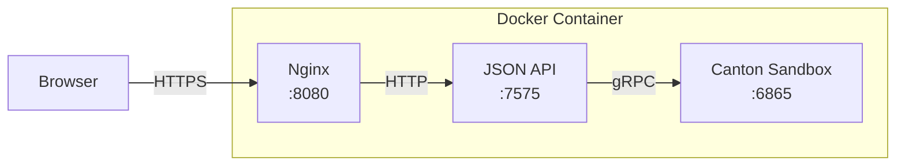
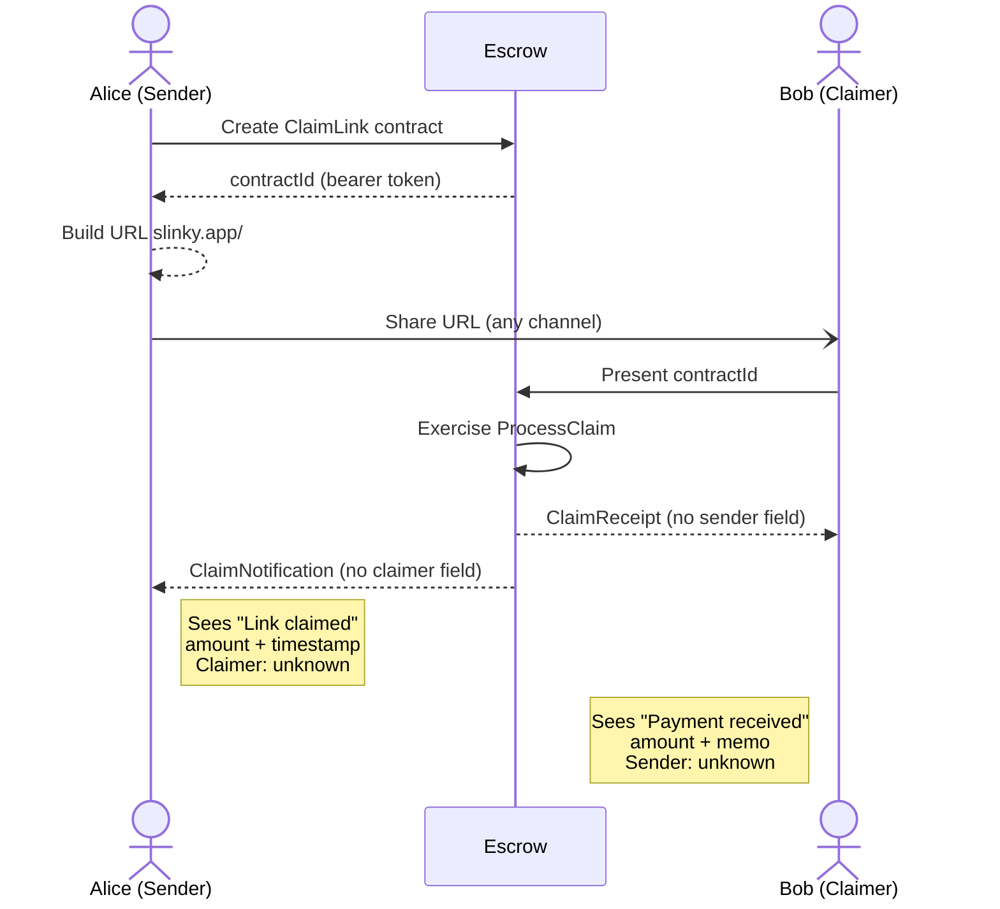

# slinky -

[](https://slinky-production.up.railway.app)
[](https://canton.network)
[](https://daml.com)
[](https://www.typescriptlang.org)
[](LICENSE)

Private payment claim links on Canton Network. Sender and claimer never learn each other's identity. Privacy enforced at the Daml contract level, not patched onto the UI.

**ETHDenver 2026 · 🏆$1,000 Winner - Canton Network Private dApp Track 🏆

[Live Demo](https://slinky-production.up.railway.app) · [Demo Video](#)

> **Hackathon project.** Runs on Canton sandbox (in-memory ledger). No real funds, no formal audit. Built in a weekend.

---

## The Problem

Sending payments today leaks identity on both sides. The sender knows the recipient's address. The recipient can trace the sender. Even on "privacy" chains, metadata analysis links wallets to identities.

**What if neither side had to know the other?**

## How Slinky Works

Slinky uses Canton Network's sub-transaction privacy to create payment links where:

- **Sender** creates a claim link and shares it. The recipient never appears on their ledger.
- **Claimer** opens the link and claims the funds. The sender never appears on their ledger.
- **The ledger itself** enforces this separation. It's not filtered in the UI. The data structurally does not exist for the other party.

### Three Steps

1. **Create** | Enter an amount and generate a unique claim link. No recipient address needed.
2. **Share** | Send the link through any channel (text, email, QR, carrier pigeon). It carries no information about you.
3. **Claim** | The recipient opens the link and claims the funds. Both sides stay private.

---

## Architecture



### Tech Stack

| Layer | Technology |
|-------|-----------|
| Smart Contracts | [Daml](https://daml.com) 2.10.3, 4 templates in `daml/Slinky.daml` |
| Ledger | [Canton Network](https://canton.network) sandbox with sub-transaction privacy |
| API | Canton JSON API, HTTP gateway to the Daml ledger |
| Frontend | React 18, TypeScript, Vite, Tailwind CSS |
| Deployment | Docker multi-stage build on [Railway](https://railway.app) |
| Proxy | Nginx, serves SPA + reverse proxies `/v1/*` to JSON API |

---

## Smart Contracts

Four Daml templates in [`daml/Slinky.daml`](daml/Slinky.daml):

### ClaimLink

The core contract. Created by the sender, exercised by the escrow service.

```
Signatory: sender    Observer: escrow
```

| Choice | Controller | What it does |
|--------|-----------|--------------|
| `ProcessClaim` | escrow | Archives the link, creates ClaimReceipt + ClaimNotification |
| `RevokeLink` | sender | Archives the link, creates RevokedLink |

### ClaimReceipt

Proof of payment for the claimer. **No sender field.**

```
Signatory: escrow    Observer: claimer
```

### ClaimNotification

Confirmation for the sender that the link was claimed. **No claimer field.**

```
Signatory: escrow    Observer: sender
```

### RevokedLink

Record that a link was cancelled before being claimed.

```
Signatory: sender    Observer: escrow
```

### Privacy Visibility Matrix

| Contract | Sender sees? | Claimer sees? | Escrow sees? |
|----------|:---:|:---:|:---:|
| ClaimLink | Yes | No | Yes |
| ClaimReceipt | **No** | Yes | Yes |
| ClaimNotification | Yes | **No** | Yes |
| RevokedLink | Yes | No | Yes |

This isn't access control. It's structural. The ClaimReceipt has no `sender` field. The ClaimNotification has no `claimer` field. Canton's sub-transaction privacy ensures each party only synchronizes on contracts where they are a stakeholder. The data doesn't exist on the other party's ledger view.

---

## Claim Link Flow



### What's the Hash in the URL?

The hash at the end of the claim URL (`#claim/00834b88bbc4...`) is the **Daml contract ID**, a unique identifier assigned by Canton when the ClaimLink contract is created.

It works as a **bearer token**: possession of the ID proves you can interact with the contract. The contract ID itself is opaque, a ledger-internal identifier that contains no metadata about the sender, the amount, or any party involved.

### Can it be traced back to the sender or claimer?

**No.** By design:

- The contract ID is an opaque hash generated by Canton. It encodes no party information.
- The ClaimReceipt (what the claimer sees) has no `sender` field. Not filtered, not encrypted, structurally absent.
- The ClaimNotification (what the sender sees) has no `claimer` field.
- Canton's sub-transaction privacy means the claimer never synchronizes on the ClaimLink contract itself (where the sender is named). They only see the ClaimReceipt, which only names the escrow and themselves.
- Even the escrow service, which sees both sides, cannot leak information that the contract templates don't contain.

---

## Escrow Model

The `escrow` party is a shared service actor (not a funds custodian) that:

1. Observes all pending ClaimLink contracts
2. Exercises `ProcessClaim` when a claimer presents a valid contract ID
3. Creates the receipt and notification in one atomic transaction

In production, the escrow would be a separate backend service with its own signing keys. In this demo, escrow JWTs are generated client-side (sandbox mode allows unsigned tokens).

---

## Local Development

### Prerequisites

- **Daml SDK 2.10.3** | `curl -sSL https://get.daml.com/ | sh -s 2.10.3`
- **Node.js 18+** | [nodejs.org](https://nodejs.org)

### Setup

```bash
# Install frontend dependencies
npm install

# Terminal 1: Start Canton sandbox + JSON API
daml start

# Terminal 2: Start Vite dev server
npm run dev
```

App opens at `http://localhost:5173`. Vite proxies `/v1/*` to the Canton JSON API at `localhost:7575`.

### Try the Demo

1. Open the app, click **Get Started**
2. Sign in as **Alice (Sender)**
3. Go to **Send**, create a payment link, copy the claim URL
4. Open a new tab (or incognito), paste the claim URL
5. Sign in as **Bob (Claimer)**, claim the payment
6. Alice sees a notification (amount + timestamp, no claimer identity)
7. Bob sees a receipt (amount + memo, no sender identity)

---

## Production Deployment

Slinky deploys as a single Docker container running Canton sandbox + JSON API + Nginx. Currently hosted on Railway.

### Docker Build

Three-stage build ([`Dockerfile`](Dockerfile)):

1. **daml-build** (`eclipse-temurin:17-jdk`) | Compiles `daml/Slinky.daml` into `slinky-0.1.0.dar`
2. **frontend-build** (`node:20-slim`) | Builds React SPA with Vite, bakes in package ID
3. **runtime** (`eclipse-temurin:17-jre`) | Runs sandbox + JSON API + Nginx

### Deploy to Railway

```bash
# Install Railway CLI
npm i -g @railway/cli

# Login and init
railway login
railway init

# Deploy
railway up
```

Railway sets `PORT` automatically. The container starts Nginx first (healthcheck passes), then boots Canton sandbox and JSON API in the background (~20s).

### Environment Variables

No env vars needed. Everything is self-contained in the Docker image:

| Variable | Set By | Value |
|----------|--------|-------|
| `PORT` | Railway (auto) | 8080 |
| `VITE_DAML_PACKAGE_ID` | Dockerfile (build-time) | Daml package hash |
| `VITE_CANTON_API_URL` | Dockerfile (build-time) | Empty (Nginx proxies) |
| `JAVA_TOOL_OPTIONS` | Dockerfile | `-Xmx1500m -Xms256m` |

---

## Project Structure

```
slinky/
├── daml/
│   └── Slinky.daml                 # 4 Daml templates (ClaimLink, Receipt, Notification, Revoked)
├── src/
│   ├── App.tsx                      # Hash-based routing
│   ├── main.tsx                     # React entry
│   ├── index.css                    # Tailwind
│   ├── lib/
│   │   ├── canton.ts                # Canton JSON API client (create, query, exercise, fetch)
│   │   └── router.ts                # Client-side hash router
│   ├── components/
│   │   ├── LandingPage.tsx          # Public homepage
│   │   ├── Auth.tsx                 # Demo login (Alice/Bob) + custom party
│   │   ├── Dashboard.tsx            # App shell with tabs
│   │   ├── SendPage.tsx             # Create payment links
│   │   ├── ClaimPage.tsx            # Claim via link
│   │   └── AccountTab.tsx           # Account info + contract explorer
│   └── contexts/
│       └── AuthContext.tsx           # Auth state, party allocation, session persistence
├── daml.yaml                        # Daml SDK 2.10.3, target 1.15
├── Dockerfile                       # 3-stage build (Daml > Frontend > Runtime)
├── nginx.conf                       # Reverse proxy config (template with $PORT)
├── start.sh                         # Container entrypoint (nginx > sandbox > json-api)
├── railway.json                     # Railway deployment config
├── .env                             # Local dev env vars
├── vite.config.ts                   # Vite config with /v1 proxy
└── tailwind.config.js               # Custom theme (accent, surface palette)
```

---

## Limitations

- **Sandbox only** | In-memory ledger, data resets on restart. No persistence.
- **No real funds** | Amounts are just numbers in Daml Decimal fields. No token transfers.
- **Client-side escrow** | In production, the escrow would be a separate trusted service.
- **Unsigned JWTs** | Sandbox mode accepts unsigned tokens. Production needs proper auth.
- **Single participant** | Sandbox runs one Canton participant. Production Canton has multiple participants with full sub-transaction privacy across organizations.

---

## Built With

- [Daml](https://daml.com) | Smart contract language with built-in privacy
- [Canton Network](https://canton.network) | Privacy-first distributed ledger
- [React](https://react.dev) + [Vite](https://vitejs.dev) + [Tailwind CSS](https://tailwindcss.com)
- [Railway](https://railway.app) | Container deployment
- [Docker](https://docker.com) | Multi-stage build

---

## Team

Built for ETHDenver 2026.

## License

MIT
